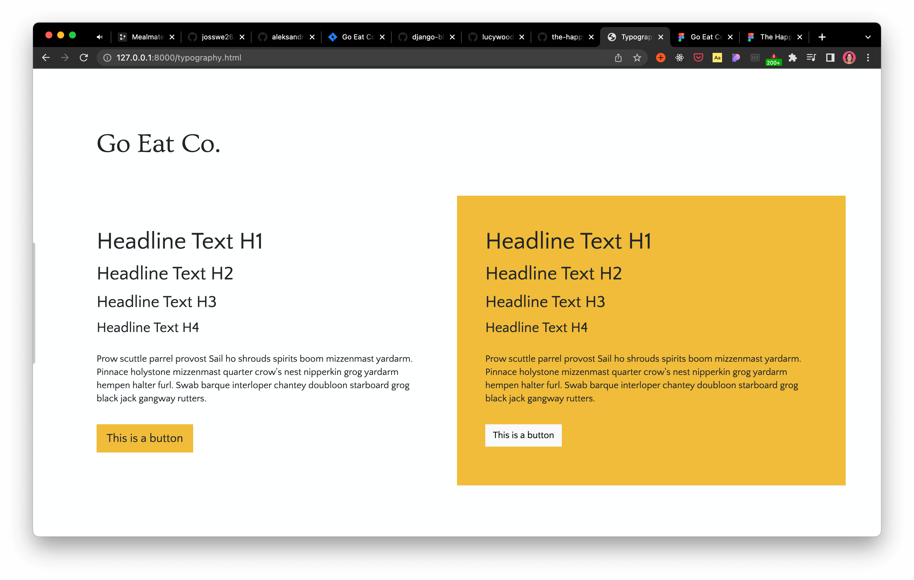

# Go Eat Co.

A Django blog-like site for creating recipes, sharing them with the community and saving them to a personal cookbook.  
Helping folk to plan their meals ahead of time with little effort.

[Live webpage](https://goeatco.herokuapp.com/)

## Table of contents

- [Go Eat Co.](#go-eat-co)
  - [Table of contents](#table-of-contents)
- [UX](#ux)
  - [Strategy](#strategy)
    - [The problem](#the-problem)
    - [The solution](#the-solution)
    - [Target audience](#target-audience)
    - [Personas](#personas)
    - [User goals](#user-goals)
    - [Business objectives](#business-objectives)
  - [Scope](#scope)
    - [User stories](#user-stories)
    - [User expectations](#user-expectations)
  - [Structure](#structure)
  - [Skeleton](#skeleton)
  - [Surface](#surface)
    - [Colours](#colours)
    - [Fonts](#fonts)
    - [Imagery](#imagery)
- [Features](#features)
  - [1. Feature name](#1-feature-name)
- [Technologies used](#technologies-used)
- [Testing](#testing)
  - [Testing user stories](#testing-user-stories)
- [Bugs](#bugs)
- [Deployment](#deployment)
- [Credits](#credits)
  - [Media](#media)
  - [Code](#code)
  - [Reference material](#reference-material)
- [Acknowledgements](#acknowledgements)
- [Retrospective](#retrospective)

# UX

## Strategy

### The problem

For busy households, there's very little time to create healthy mealplans for the family. This leads to expensive and less healthy alternatives (takeout), wasted food and sometimes frustrating mealtimes too!

### The solution

Go Eat Co. has created an app which is designed and developed that make meal planning easy. By using a shared library of recipes it's easy to save recipes to a personal cookbook for easy finding later. With a community-updated library of ingredients, it's also quick to put together your own recipes and share them with the community. This helps to save time and make meal planning a joy!

### Target audience
Anyone juggling multiple responsibilities but also looking to take care of their health by eating well. Especially great for busy parents who are tired of coming up with healthy solutions for fussy children.

### Personas
Chris, 38, single, parent to 2 children (aged 9 and 10), works for the NHS, vegetarian.
Introverted and active, cares about health and fitness for himself and his children. Tends to work too much. Loves the outdoors and to hike or cycle everywhere.

Sophie, 36, married, parent to 4 children (aged from 2 to 9) and a labrador.
Social and semi-active, very short on time with a full calendar of family events. Loves organising parties and sleepovers. Always puts her family first. Enjoys walking and cares about the environment and her family's impact.

### User goals
- Be more organised in the kitchen.
- Reduce kitchen waste.
- Eat healthily.
- Save money.

### Business objectives
- Create an MVP that lets people register, login, create ingredients and recipes, and save them to their personal cookbooks.
- Build a community of users that will help beta test future releases and potentially pay for premium features, such as celebrity cooks/chefs.

---

## Scope

### User stories
1. As a user I want the app to be simple to navigate so I can find my way around easily.
2. As a user I want to login to an area of the app where I can see information that's relevant to just me.
3. As a user I want to manage my profile so I can keep it up to date.
4. As a user I want to add ingredients to the database to be added to future recipes.
5. As a user I want to add recipes that can be shared with the community.
6. As a user I want to manage my own recipes so I can edit or remove them as required.
7. As a user I want to be able to save recipes to a personal cookbook to find favourites quickly.
8. As a user I want to be able to search recipes to find something faster than just browsing.
9. As a user I want to see recipe ratings to see how others found them.
10. As a user I want to follow recipe authors to see when they publish new recipes.

### User expectations
11. As a user I expect the app to be responsive.
12. As a user I expect the app to be accessible.
13. As a user I expect my data to be secure.
14. As a user I expect the app to give me feedback on my actions.

Feature	| Importance	| Feasibility/Viability | Priority
--- | :---: | :---: | ---
Simple navigation|	7|	10|	need
User login|	11|	14|	critical
Profile management|	4|	3|	nice to have
Add ingredients|	6|	13|	need
Add recipes|	10|	9|	need
Edit/Delete recipes|	9|	8|	need
Save recipes to cookbook|	5|	4|	nice to have
Search recipes|	3|	7|	nice to have
Recipe ratings|	2|	2|	want
Follow authors|	1|	1|	want
Responsive design|	14|	12|	critical
Accessible design|	13|	5|	need
Secure data|	12|	11|	critical
User feedback|	8|	6|	need

---

## Structure

User journey

---

## Skeleton

Wireframes

Home page

Pricing page

Gallery page

Contact page

---

## Surface

With a potentially busy app once filled with data, I wanted the brand to stay out of the way and act more as a elegant but welcoming backdrop to the recipes, which take the center stage. I settled on the following keywords to lead the brand design.

- Clean
- Unobtrusive
- Simple
- Elegant

### Colours

I wanted to keep to a neutral palette for Go Eat Co., to keep it out of the way and let the food images really shine. After all, the best thing about browsing recipes, whether on a website or in a book, is excellent photography!

I did add a golden yellow to use as the primary button colour. Enough to help it to stand out as to be used for a call to action, but keeps with the elegant theme of the brand.

### Fonts

The logo uses Ovo, which is based on classical fonts, but has softened serifs to give it a warmer feel. Fits nicely with the "elegant" keyword. It's a midweight font which helps it to stay subtle and charming.

The font used throughout the rest of the site is Quattrocento Sans, which is described as "a classic, elegant and sober typeface family. Warm, readable and not intrusive.". I think it fits perfectly!

### Imagery

I haven't added any imagery on this site outside of the recipes. As previously mentioned, I wanted the recipes and their photography to be of the highest priority.

# Features

Explain which features were added and which are omitted and why.

## 1. Feature name

Description and which user stories are addressed.

# Technologies used

# Testing

Refer to the assessment guide to make sure the correct aspects are tested.

## Testing user stories

1. As a... I want...

| **Feature**  | **Action**   | **Expected Result** | **Actual Result** |
| ------------ | ------------ | ------------------- | ----------------- |
| Feature name | User journey | Goal                | Outcome           |

Screenshots

# Bugs

| **Bug**         | **Fix** |
| --------------- | ------- |
| Bug explanation | Bug fix |

# Deployment

The website was deployed using GitHub Pages by following these steps:

1. In the GitHub repository navigate to the Settings tab
2. On the left hand menu select Pages
3. For the source select Branch: master
4. After the webpage refreshes automaticaly you will se a ribbon on the top saying: "Your site is published at..."

You can for fork the repository by following these steps:

1. Go to the GitHub repository
2. Click on Fork button in upper right hand corner

You can clone the repository by following these steps:

1. Go to the GitHub repository
2. Locate the Code button above the list of files and click it
3. Select if you prefere to clone using HTTPS, SSH, or Github CLI and click the copy button to copy the URL to your clipboard
4. Open Git Bash
5. Change the current working directory to the one where you want the cloned directory
6. Type git clone and paste the URL from the clipboard ($ git clone https://github.com/YOUR-USERNAME/YOUR-REPOSITORY)
7. Press Enter to create your local clone.

# Credits

## Media

## Code

## Reference material

# Acknowledgements

I would like to take the opportunity to thank:

- My family, friends and colleagues for their advice, support and help with testing.
- My mentor for their feedback, advice and support.
- Code Institute Slack for advice.

# Retrospective

SWOT analysis