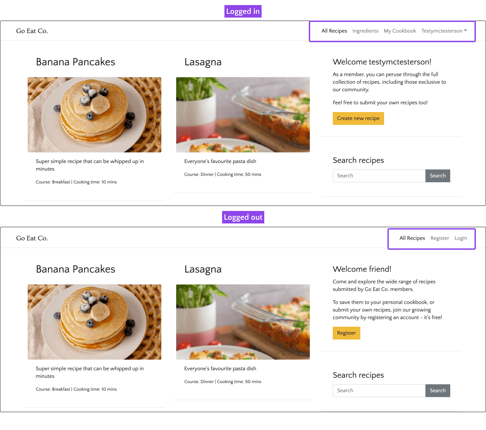
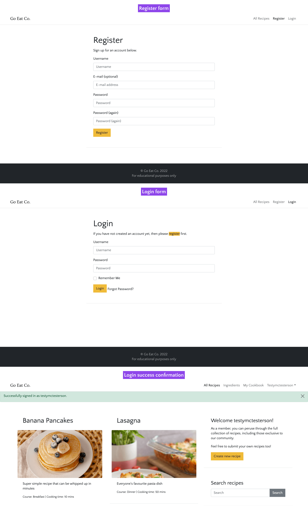
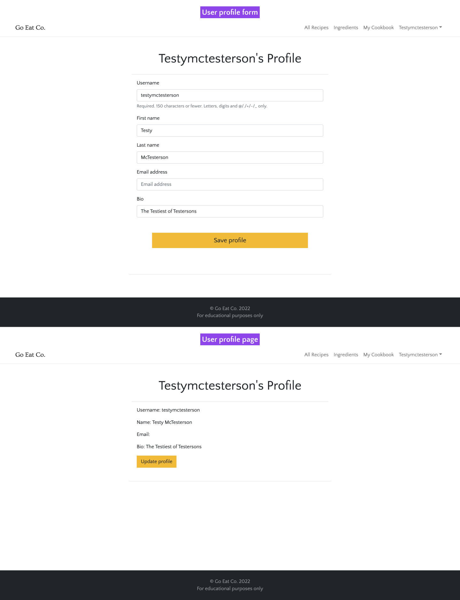
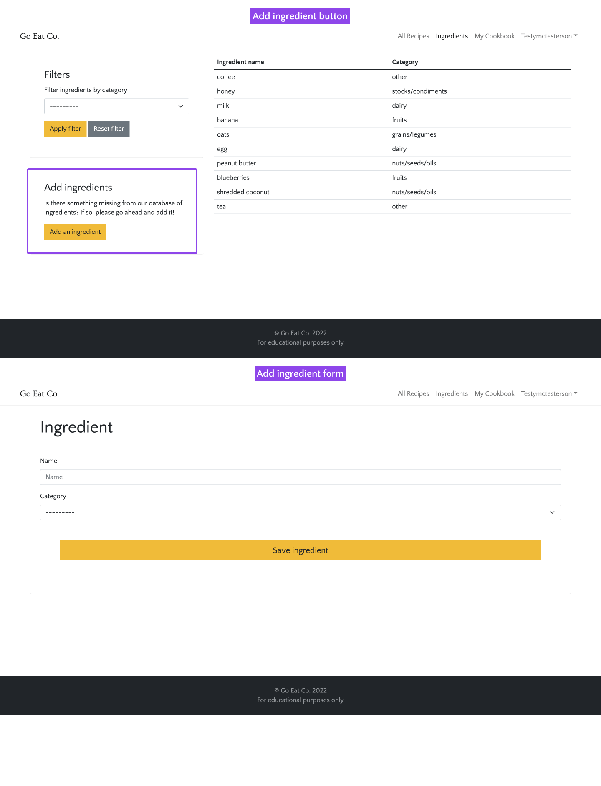
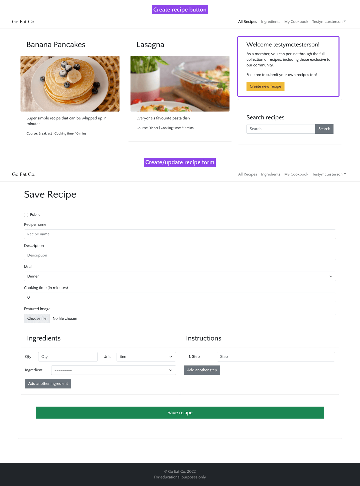
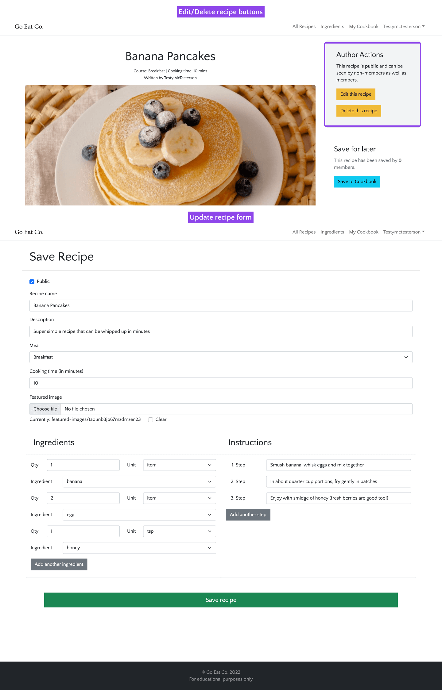
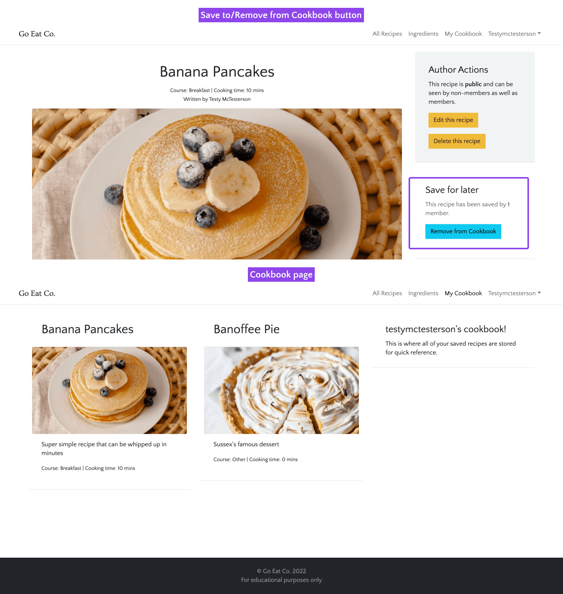
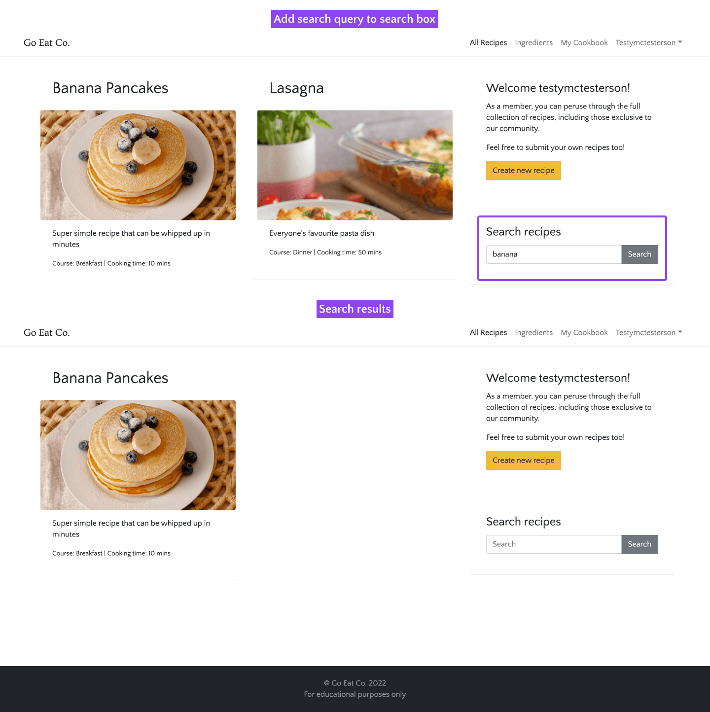
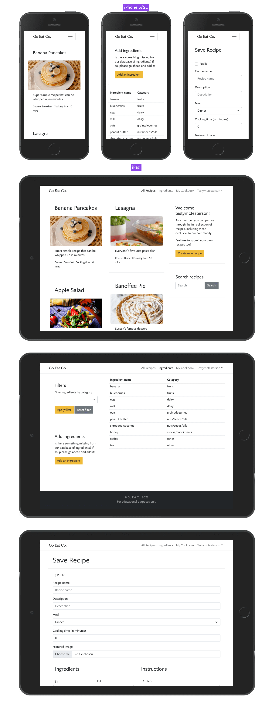

# Go Eat Co.

A Django blog-like site for creating recipes, sharing them with the community and saving them to a personal cookbook. Helping folk to plan their meals ahead of time with little effort.

[Live webpage](https://goeatco.herokuapp.com/)

## Table of contents

- [Go Eat Co.](#go-eat-co)
  - [Table of contents](#table-of-contents)
- [UX](#ux)
  - [Strategy](#strategy)
    - [The problem](#the-problem)
    - [The solution](#the-solution)
    - [Target audience](#target-audience)
    - [Personas](#personas)
    - [User goals](#user-goals)
    - [Business objectives](#business-objectives)
  - [Scope](#scope)
    - [User stories](#user-stories)
    - [User expectations](#user-expectations)
    - [Site owner stories](#site-owner-stories)
  - [Structure](#structure)
  - [Skeleton](#skeleton)
  - [Surface](#surface)
    - [Colours](#colours)
    - [Fonts](#fonts)
- [Features](#features)
  - [1. Feature name](#1-feature-name)
- [Technologies used](#technologies-used)
  - [Languages](#languages)
- [Testing](#testing)
  - [Testing user stories](#testing-user-stories)
- [Bugs](#bugs)
- [Deployment](#deployment)
- [Credits](#credits)
  - [Media](#media)
  - [Code](#code)
  - [Reference material](#reference-material)
- [Acknowledgements](#acknowledgements)
- [Retrospective](#retrospective)

# UX

## Strategy

### The problem

For busy households, there's very little time to create healthy mealplans for the family. This leads to expensive and less healthy alternatives (takeout), wasted food and sometimes frustrating mealtimes too!

### The solution

Go Eat Co. has created an app which is designed and developed that make meal planning easy. By using a shared library of recipes it's easy to save recipes to a personal cookbook for easy finding later. With a community-updated library of ingredients, it's also quick to put together your own recipes and share them with the community. This helps to save time and make meal planning a joy!

### Target audience
Anyone juggling multiple responsibilities but also looking to take care of their health by eating well. Especially great for busy parents who are tired of coming up with healthy solutions for fussy children.

### Personas
Chris, 38, single, parent to 2 children (aged 9 and 10), works for the NHS, vegetarian.
Introverted and active, cares about health and fitness for himself and his children. Tends to work too much. Loves the outdoors and to hike or cycle everywhere.

Sophie, 36, married, parent to 4 children (aged from 2 to 9) and a labrador.
Social and semi-active, very short on time with a full calendar of family events. Loves organising parties and sleepovers. Always puts her family first. Enjoys walking and cares about the environment and her family's impact.

### User goals
- Be more organised in the kitchen.
- Reduce kitchen waste.
- Eat healthily.
- Save money.

### Business objectives
- Create an MVP that lets people register, login, create ingredients and recipes, and save them to their personal cookbooks.
- Build a community of users that will help beta test future releases and potentially pay for premium features, such as celebrity cooks/chefs.

*Go back to the [top](#table-of-contents)*

---

## Scope

### User stories
1. As a user I want the app to be simple to navigate so I can find my way around easily.
2. As a user I want to login to an area of the app where I can see information that's relevant to just me.
3. As a user I want to manage my profile so I can keep it up to date.
4. As a user I want to add ingredients to the database to be added to future recipes.
5. As a user I want to add recipes that can be shared with the community.
6. As a user I want to manage my own recipes so I can edit or remove them as required.
7. As a user I want to be able to save recipes to a personal cookbook to find favourites quickly.
8. As a user I want to be able to search recipes to find something faster than just browsing.
9. As a user I want to see recipe ratings to see how others found them.
10. As a user I want to follow recipe authors to see when they publish new recipes.

### User expectations
11. As a user I expect the app to be responsive.
12. As a user I expect the app to be accessible.
13. As a user I expect my data to be secure.
14. As a user I expect the app to give me feedback on my actions.

### Site owner stories
15. As the site owner, I want only superusers to be able to edit or remove ingredients to prevent them being accidentally removed from existing recipes.
16. As the site owner, I want only logged in users to be able to create recipes/ingredients and save recipes.
17. As the site owner, I want only logged in users to be able to see community exclusive recipes.
18. As the site owner, if an error occurs, I want users to be able to navigate back to the homepage without using the back button.

I converted the above user stories into features and ranked them by order of importance and how feasible/viable they are to complete. This let me chart the resulting numbers (see priority chart below) to help work out whether or not to include the features in the project given the constraints.

The priorities are "critical", "need", "nice to have", "want". I made sure to get all of the "critical" and "needed" features into the first version of the app, and any "nice to haves" that I had time for. The "wants" can wait until a later version.

Feature	| Importance	| Feasibility/Viability | Priority
--- | :---: | :---: | ---
Simple navigation|	7|	10|	need
User login|	11|	14|	critical
Profile management|	4|	3|	nice to have
Add ingredients|	6|	13|	need
Add recipes|	10|	9|	need
Edit/Delete recipes|	9|	8|	need
Save recipes to cookbook|	5|	4|	nice to have
Search recipes|	3|	7|	nice to have
Recipe ratings|	2|	2|	want
Follow authors|	1|	1|	want
Responsive design|	14|	12|	critical
Accessible design|	13|	5|	need
Secure data|	12|	11|	critical
User feedback|	8|	6|	need

Priority chart

I used Jira to manage this project. Using Agile development methodologies, the project was broken up into Epics. Then each User Story was added to it's relevant Epic, and each User Story was further broken down into smaller tasks. These were then worked as 2 week sprints.

First sprint

Second sprint

Demonstration of Epic -> User Story -> Tasks

---

## Structure

User journey diagram - with the help up of Lucid app.

---

## Skeleton

Wireframes - these were doodled onto paper first, then drawn up in Figma.

Home page (logged out)

Home page (logged in)

Recipe detail page (not the author)

Recipe detail page (the author)

Create or update a recipe page

Ingredient list

---

## Surface

With a potentially busy app once filled with data, I wanted the brand to stay out of the way and act more as a elegant but welcoming backdrop to the recipes, which take the center stage. I settled on the following keywords to lead the brand design.

- Clean
- Unobtrusive
- Simple
- Elegant

### Colours

I wanted to keep to a neutral palette for Go Eat Co., to keep it out of the way and let the food images really shine. After all, the best thing about browsing recipes, whether on a website or in a book, is excellent photography!

I did add a golden yellow to use as the primary button colour. Enough to help it to stand out as to be used for a call to action, but keeps with the elegant theme of the brand.

### Fonts

The logo uses Ovo, which is based on classical fonts, but has softened serifs to give it a warmer feel. Fits nicely with the "elegant" keyword. It's a midweight font which helps it to stay subtle and charming.

The font used throughout the rest of the site is Quattrocento Sans, which is described as "a classic, elegant and sober typeface family. Warm, readable and not intrusive.". I think it fits perfectly!

*Go back to the [top](#table-of-contents)*

---

# Features

Everything that was scheduled to be added to the app has been implemented.

## 1. Feature name

Description and which user stories are addressed.

*Go back to the [top](#table-of-contents)*

---

# Technologies used

## Languages

- HTML5 with Bootstrap 5
- CSS3
- Python / Django
- JavaScript (JQuery)

*Go back to the [top](#table-of-contents)*

---

# Testing

!!!!!!Refer to the assessment guide to make sure the correct aspects are tested.

## Testing user stories

1. As a user I want the app to be simple to navigate so I can find my way around easily.

| **Feature**  | **Action**   | **Expected Result** | **Actual Result** |
| ------------ | ------------ | ------------------- | ----------------- |
| Navigation bar | Open any page of the app | Be able to navigate to any other page easily | Works as expected |

Screenshots

2. As a user I want to login to an area of the app where I can see information that's relevant to just me.

| **Feature**  | **Action**   | **Expected Result** | **Actual Result** |
| ------------ | ------------ | ------------------- | ----------------- |
| Register account | Click on "Register" | Register an account | Works as expected
| User login | Click on "Login" | Be able to access logged-in areas of the site, such as Cookbook | Works as expected |

Screenshots

3. As a user I want to manage my profile so I can keep it up to date.

| **Feature**  | **Action**   | **Expected Result** | **Actual Result** |
| ------------ | ------------ | ------------------- | ----------------- |
| My Profile page | Hover over username, click on "My Profile". Then click on "Update profile" button | Be able to update profile information                | Works as expected           |

Screenshots

4. As a user I want to add ingredients to the database to be added to future recipes.

| **Feature**  | **Action**   | **Expected Result** | **Actual Result** |
| ------------ | ------------ | ------------------- | ----------------- |
| Ingredient List | Click on "Ingredients". Click on "Add an ingredient" button | Create an ingredient                | Works as expected           |

Screenshots

5. As a user I want to add recipes that can be shared with the community.

| **Feature**  | **Action**   | **Expected Result** | **Actual Result** |
| ------------ | ------------ | ------------------- | ----------------- |
| Homepage sidebar | Click on "Create new recipe" button | Create a recipe                | Works as expected           |

Screenshots

6. As a user I want to manage my own recipes so I can edit or remove them as required.

| **Feature**  | **Action**   | **Expected Result** | **Actual Result** |
| ------------ | ------------ | ------------------- | ----------------- |
| Recipe detail page | Go to home/"All recipes" page. Click on authored recipe. Click on "Edit this recipe" | Update the recipe details                | Works as expected           |
| Recipe detail page | Go to home/"All recipes" page. Click on authored recipe. Click on "Delete this recipe" | Delete the recipe                | Works as expected           |

Screenshots

7. As a user I want to be able to save recipes to a personal cookbook to find favourites quickly.

| **Feature**  | **Action**   | **Expected Result** | **Actual Result** |
| ------------ | ------------ | ------------------- | ----------------- |
| Recipe detail page | Go to home/"All recipes" page. Click on "Save to cookbook" button | Saves the recipe to the Cookbook                | Works as expected           |
| Cookbook page | Open the Cookbook page | See all saved recipes in one place | Works as expected |

Screenshots

8. As a user I want to be able to search recipes to find something faster than just browsing.

| **Feature**  | **Action**   | **Expected Result** | **Actual Result** |
| ------------ | ------------ | ------------------- | ----------------- |
| Home page sidebar | Go to home/"All recipes" page. Add a search query to the search field in the sidebar. Click "Search" button | The relevant search results appear on the page                | Works as expected           |

Screenshots

~~9. As a user I want to see recipe ratings to see how others found them.~~
~~10. As a user I want to follow recipe authors to see when they publish new recipes.~~

User stories 9 and 10 were omitted from the MVP of the app.

11.   As a user I expect the app to be responsive.

| **Feature**  | **Action**   | **Expected Result** | **Actual Result** |
| ------------ | ------------ | ------------------- | ----------------- |
| Responsive design | View the site on different devices | Site alters to fit the different screen sizes                | Works as expected           |

Screenshots

12.  As a user I expect the app to be accessible.

!!!!!!!See accessibility testing.

13. As a user I expect my data to be secure.

| **Feature**  | **Action**   | **Expected Result** | **Actual Result** |
| ------------ | ------------ | ------------------- | ----------------- |
| Cross site request forgery (CSRF) protection | Submit information via any form | Data is secure                | Works as expected           |

Screenshots

14. As a user I expect the app to give me feedback on my actions.

| **Feature**  | **Action**   | **Expected Result** | **Actual Result** |
| ------------ | ------------ | ------------------- | ----------------- |
| Forms | Try to submit incorrect information in a form | The form does not submit and flags the issue                | Works as expected           |

Screenshots

15. As the site owner, I want only superusers to be able to edit or remove ingredients to prevent them being accidentally removed from existing recipes.

| **Feature**  | **Action**   | **Expected Result** | **Actual Result** |
| ------------ | ------------ | ------------------- | ----------------- |
| Ingredient list | Login as superuser and go to ingredient list | See "Edit" and "Delete" buttons for ingredients                | Works as expected           |
| Ingredient list | Login as a normal user and go to ingredient list | See just the list of ingredients (no action buttons)                | Works as expected           |
| Update Ingredient page | Logout or login as a normal user and go to /ingredients/update/1/ | See a 404 page                | Works as expected           |

Screenshots

16.  As the site owner, I want only logged in users to be able to create recipes/ingredients and save recipes.

| **Feature**  | **Action**   | **Expected Result** | **Actual Result** |
| ------------ | ------------ | ------------------- | ----------------- |
| Home page sidebar | Logout and go Home | Unable to see the "Create new recipe" button                | Works as expected           |
| Create recipe page | Logout and navigate to /recipe/create | Redirected to login page                | Works as expected           |
| Home page sidebar | Login and go Home | See the "Create new recipe" button | Works as expected |
| Navigation bar | Logout and go to any page | Unable to see the Ingredients link in the navbar | Works as expected |
| Ingredients page sidebar | Login and go to Ingredients page | See "Add an ingredient" button in the sidebar

Screenshots

17. As the site owner, I want only logged in users to be able to see community exclusive recipes.

| **Feature**  | **Action**   | **Expected Result** | **Actual Result** |
| ------------ | ------------ | ------------------- | ----------------- |
| Exclusive recipes | Create a recipe, leave "Public" box unchecked, logout and go Home | The new recipe won't be there or be searchable                | Works as expected           |

Screenshots

18. As the site owner, if an error occurs, I want users to be able to navigate back to the homepage without using the back button.

| **Feature**  | **Action**   | **Expected Result** | **Actual Result** |
| ------------ | ------------ | ------------------- | ----------------- |
| Custom 404 page | Go to a random URI | See custom 404 page                | Works as expected           |

Screenshots

*Go back to the [top](#table-of-contents)*

---

# Bugs

| **Bug**         | **Fix** |
| --------------- | ------- |
| Bug explanation | Bug fix |

*Go back to the [top](#table-of-contents)*

---

# Deployment

The website was deployed using GitHub Pages by following these steps:

1. In the GitHub repository navigate to the Settings tab
2. On the left hand menu select Pages
3. For the source select Branch: master
4. After the webpage refreshes automaticaly you will se a ribbon on the top saying: "Your site is published at..."

You can for fork the repository by following these steps:

1. Go to the GitHub repository
2. Click on Fork button in upper right hand corner

You can clone the repository by following these steps:

1. Go to the GitHub repository
2. Locate the Code button above the list of files and click it
3. Select if you prefere to clone using HTTPS, SSH, or Github CLI and click the copy button to copy the URL to your clipboard
4. Open Git Bash
5. Change the current working directory to the one where you want the cloned directory
6. Type git clone and paste the URL from the clipboard ($ git clone https://github.com/YOUR-USERNAME/YOUR-REPOSITORY)
7. Press Enter to create your local clone.

*Go back to the [top](#table-of-contents)*

---

# Credits

## Media

## Code

## Reference material

*Go back to the [top](#table-of-contents)*

---

# Acknowledgements

I would like to take the opportunity to thank:

- My family, friends and colleagues for their advice, support and help with testing.
- My mentor for their feedback, advice and support.
- Code Institute Slack for advice.

*Go back to the [top](#table-of-contents)*

---

# Retrospective

SWOT analysis