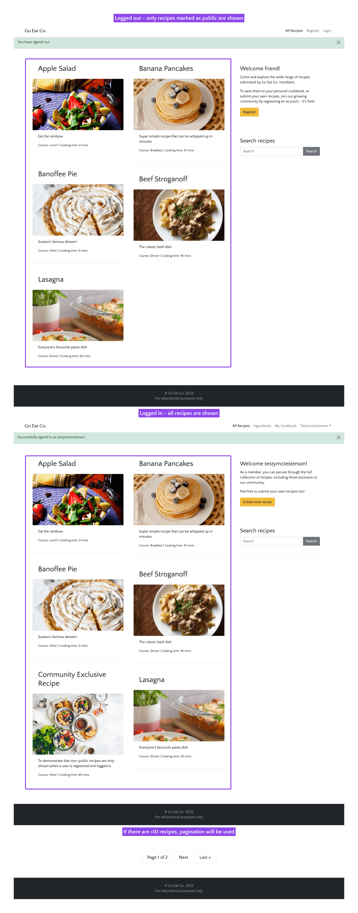
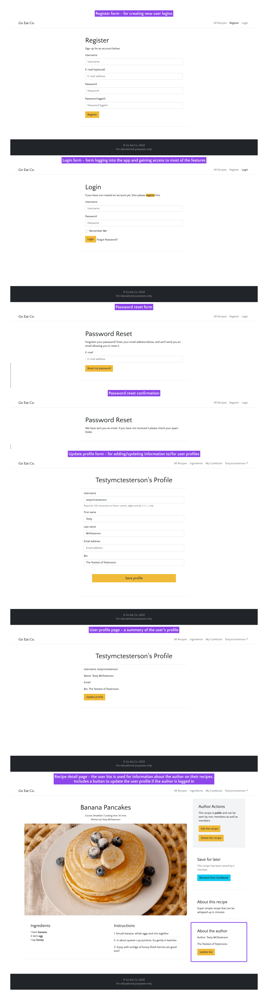
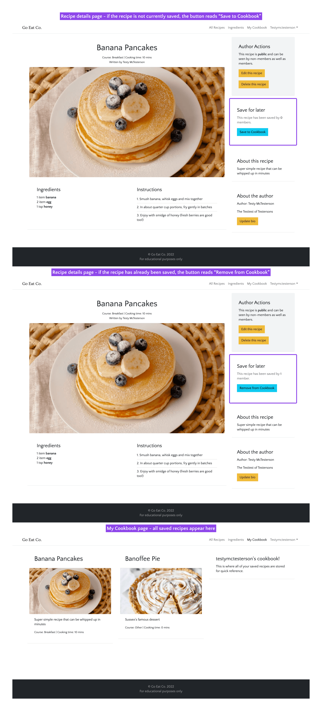

# Go Eat Co.

A Django blog-like site for creating recipes, sharing them with the community and saving them to a personal cookbook. Helping folk to plan their meals ahead of time with little effort.

[Live webpage](https://goeatco.herokuapp.com/)


## Table of contents

- [Go Eat Co.](#go-eat-co)
  - [Table of contents](#table-of-contents)
- [UX](#ux)
  - [Strategy](#strategy)
    - [The problem](#the-problem)
    - [The solution](#the-solution)
    - [Target audience](#target-audience)
    - [Personas](#personas)
    - [User goals](#user-goals)
    - [Business objectives](#business-objectives)
  - [Scope](#scope)
    - [User stories](#user-stories)
    - [User expectations](#user-expectations)
    - [Site owner stories](#site-owner-stories)
  - [Structure](#structure)
  - [Skeleton](#skeleton)
  - [Surface](#surface)
    - [Colours](#colours)
    - [Fonts](#fonts)
    - [Images](#images)
- [Agile development process](#agile-development-process)
- [Features](#features)
  - [1. Logo and Navigation bar](#1-logo-and-navigation-bar)
  - [2. Homepage/recipe list](#2-homepagerecipe-list)
  - [3. Homepage/recipe list sidebar](#3-homepagerecipe-list-sidebar)
  - [4. User registration and login](#4-user-registration-and-login)
  - [5. Managing recipes](#5-managing-recipes)
  - [6. Managing the cookbook](#6-managing-the-cookbook)
  - [7. Managing ingredients](#7-managing-ingredients)
  - [8. Error pages](#8-error-pages)
- [Testing](#testing)
- [Bugs](#bugs)
- [Deployment](#deployment)
- [Technologies used](#technologies-used)
  - [Languages](#languages)
- [Credits](#credits)
  - [Media](#media)
  - [Code](#code)
  - [Reference material](#reference-material)
- [Acknowledgements](#acknowledgements)
- [Retrospective](#retrospective)

# UX

## Strategy

### The problem

For busy households, there's very little time to create healthy mealplans for the family. This leads to expensive and less healthy alternatives (takeout), wasted food and sometimes frustrating mealtimes too!

### The solution

Go Eat Co. has created an app which is designed and developed that make meal planning easy. By using a shared library of recipes it's easy to save recipes to a personal cookbook for easy finding later. With a community-updated library of ingredients, it's also quick to put together your own recipes and share them with the community. This helps to save time and make meal planning a joy!

### Target audience
Anyone juggling multiple responsibilities but also looking to take care of their health by eating well. Especially great for busy parents who are tired of coming up with healthy solutions for fussy children.

### Personas
Chris, 38, single, parent to 2 children (aged 9 and 10), works for the NHS, vegetarian.
Introverted and active, cares about health and fitness for himself and his children. Tends to work too much. Loves the outdoors and to hike or cycle everywhere.

Sophie, 36, married, parent to 4 children (aged from 2 to 9) and a labrador.
Social and semi-active, very short on time with a full calendar of family events. Loves organising parties and sleepovers. Always puts her family first. Enjoys walking and cares about the environment and her family's impact.

### User goals
- Be more organised in the kitchen.
- Reduce kitchen waste.
- Eat healthily.
- Save money.

### Business objectives
- Create an MVP that lets people register, login, create ingredients and recipes, and save them to their personal cookbooks.
- Build a community of users that will help beta test future releases and potentially pay for premium features, such as celebrity cooks/chefs.

*Go back to the [top](#table-of-contents)*

---

## Scope

### User stories
1. As a user I want the app to be simple to navigate so I can find my way around easily.
2. As a user I want to login to an area of the app where I can see information that's relevant to just me.
3. As a user I want to manage my profile so I can keep it up to date.
4. As a user I want to add ingredients to the database to be added to future recipes.
5. As a user I want to add recipes that can be shared with the community.
6. As a user I want to manage my own recipes so I can edit or remove them as required.
7. As a user I want to be able to save recipes to a personal cookbook to find favourites quickly.
8. As a user I want to be able to search recipes to find something faster than just browsing.
9. As a user I want to see recipe ratings to see how others found them.
10. As a user I want to follow recipe authors to see when they publish new recipes.

### User expectations
11. As a user I expect the app to be responsive.
12. As a user I expect the app to be accessible.
13. As a user I expect my data to be secure.
14. As a user I expect the app to give me feedback on my actions.

### Site owner stories
15. As the site owner, I want only superusers to be able to edit or remove ingredients to prevent them being accidentally removed from existing recipes.
16. As the site owner, I want only logged in users to be able to create recipes/ingredients and save recipes.
17. As the site owner, I want only logged in users to be able to see community exclusive recipes.
18. As the site owner, if an error occurs, I want users to be able to navigate back to the homepage without using the back button.

I converted the above user stories into features and ranked them by order of importance and how feasible/viable they are to complete. This let me chart the resulting numbers (see priority chart below) to help work out whether or not to include the features in the project given the constraints.

The priorities are "critical", "need", "nice to have", "want". I made sure to get all of the "critical" and "needed" features into the first version of the app, and any "nice to haves" that I had time for. The "wants" can wait until a later version.

Feature	| Importance	| Feasibility/Viability | Priority
--- | :---: | :---: | ---
Simple navigation|	7|	10|	need
User login|	11|	14|	critical
Profile management|	4|	3|	nice to have
Add ingredients|	6|	13|	need
Add recipes|	10|	9|	need
Edit/Delete recipes|	9|	8|	need
Save recipes to cookbook|	5|	4|	nice to have
Search recipes|	3|	7|	nice to have
Recipe ratings|	2|	2|	want
Follow authors|	1|	1|	want
Responsive design|	14|	12|	critical
Accessible design|	13|	5|	need
Secure data|	12|	11|	critical
User feedback|	8|	6|	need

<details><summary>Priority chart</summary>

</details>

---

## Structure

**User journey diagram**
The majority of the app is best when logged in, creating a more dynamic and personalised experience.
Thanks to Lucid app for helping me to create the diagram of the user journeys.


**Database models**
The category and ingredient models are simple and straightforward. It starts to get a little complicated with the introduction of the ingredients meta model. I started with just the ingredients and recipe models, but wanted to save the recipe requirements in a way where they wouldn't bloat out the recipe model objects.

The user model has been extended by the profile model to add a bio.
Thanks to DrawSQL for helping me to create the diagram of the models.


---

## Skeleton

Wireframes - these were sketched onto paper first, then the main wireframes drawn up in Figma.

<details><summary>Home page (logged out)</summary>

</details>
<details><summary>Home page (logged in)</summary>

</details>
<details><summary>Recipe detail page (not the author)</summary>

</details>
<details><summary>Recipe detail page (the author)</summary>

</details>
<details><summary>Create or update a recipe page</summary>

</details>
<details><summary>Ingredient list</summary>

</details>

---

## Surface

With a potentially busy app once filled with data, I wanted the brand to stay out of the way and act more as a elegant but welcoming backdrop to the recipes, which take the center stage. I settled on the following keywords to lead the brand design.

- Clean
- Unobtrusive
- Simple
- Elegant

### Colours

I wanted to keep to a neutral palette for Go Eat Co., to keep it out of the way and let the food images really shine. After all, the best thing about browsing recipes, whether on a website or in a book, is excellent photography!

I did add a golden yellow to use as the primary button colour. Enough to help it to stand out as to be used for a call to action, but keeps with the elegant theme of the brand.


### Fonts

The logo uses Ovo, which is based on classical fonts, but has softened serifs to give it a warmer feel. Fits nicely with the "elegant" keyword. It's a midweight font which helps it to stay subtle and charming.

The font used throughout the rest of the site is Quattrocento Sans, which is described as "a classic, elegant and sober typeface family. Warm, readable and not intrusive.". I think it fits perfectly!


### Images

The images used in the demonstration of the app are all wonderful photographs from Unsplash.

*Go back to the [top](#table-of-contents)*

---

# Agile development process

I used Jira to manage this project. Using Agile development methodologies, the project was broken up into Epics. Then each User Story was added to it's relevant Epic, and each User Story was further broken down into smaller tasks.

The first two sprints were used to plan out the project, with the following two sprints used on development. I aimed for 2 weeks per sprint, but it was not strictly kept, due to having to fit the project time around my full time job and family.

<details><summary>First sprint</summary>

</details>
<details><summary>Second sprint</summary>

</details>
<details><summary>Demonstration of Epic -> User Story -> Tasks</summary>

</details>

*Go back to the [top](#table-of-contents)*

---

# Features

Everything that was scheduled to be added to the app has been implemented.

## 1. Logo and Navigation bar

A persistent navigation bar that remains in place when scrolling. It helps users to always know where they are by showing the logo, highlighting the active page and providing links to other pages (depending on their logged-in status).

It provides a bit of personalisation by using the user's username in the top right when they are logged in. And provides a dropdown menu from the username to access the user's profile and the logout option.

- The logged out menu limits the navigation to just the pages that are accessible without having registered an account. These are "All Recipes" (home), "Register" and "Login".
- The logged in menu provides links for the extra pages that become available to authorised users. These are "All Recipes", "Ingredients", "My Cookbook", and the user dropdown menu which reads as the logged in user's username.
-  The user dropdown menu consists of "My Profile" and "Logout".
-  The navigation bar is fully responsive. The menu is switched out for a hamburger icon to toggle the view of the navigation on smaller screens.

- User stories covered: 1, 2, 3, 4, 7, 11, 12, 18.

<details><summary>Feature images</summary>

</details>

## 2. Homepage/recipe list

A dynamic homepage that changes depending on whether the user is logged out (only shows "public" recipes), logged in (shows all recipes) or using the search form to filter recipes.

- When a user is logged out, the recipes shown on the homepage are only those marked as "public".
- When a user is logged in, all of the recipes are shown, public or not.
- If there are more than 10 recipes available to display, the list will paginate. This provides a navigation at the bottom of the page to click through the pages of recipes. 

:bust_in_silhouette: User stories covered: 1, 2, 5, 6, 7, 8, 11, 12, 13, 14, 16, 17, 18.

<details><summary>Feature images</summary>

</details>

## 3. Homepage/recipe list sidebar

A dynamic sidebar section on the homepage. It will display a generic welcome message to logged out users, along with a "Register" button to encourage registration. 

For logged in users, there's a more personal welcome message with more information around which recipes can be seen. There's also a "Create new recipe" button instead of "Register".

Both logged in and logged out users see the search field and are able to filter recipes by search queries.

:bust_in_silhouette: User stories covered: 2, 5, 6, 7, 8, 11, 12, 13, 16, 18

<details><summary>Feature images</summary>

</details>

## 4. User registration and login

To be able to access the exclusive (non-public) recipes of the community, or create recipes and use the cookbook, a user needs to register and login.

- The registration form is a straightforward form for a username, email and password. This will create a user object in the database, allowing the user to login.
- The login form has a link to the registration form, to encourage users to register if they stumble upon the login page.
- The login form has a "Forgot password" link. This goes to a further form for entering the user's email address to send a password reset link to. Which then goes to a confirmation page. (This does not actually send an email, however, as the email functionality has not been set up within the project).
- Once a user is logged in, they have the option to add further information to their profile. This can be accessed from the "My Profile" link in the user dropdown menu, and allows for a name and bio to be added, as well as the option to update any of the user's details.
- The user's bio is used as a short intro to the author in the recipe details of any recipes they've created.

:bust_in_silhouette: User stories covered: 2, 3, 11, 12, 13, 14, 16, 17, 18

<details><summary>Feature images</summary>

</details>

## 5. Managing recipes

From the home page, when a user is logged in, there is a "Create new recipe" button in the sidebar to save new recipes to the database.

If a user is logged in and also the author of a recipe they're viewing, the "Edit recipe" and "Delete recipe" buttons will show in the sidebar.

- The create/update form requires a unique name, as this is used for the recipe slug. It will otherwise show an error.
- There is a placeholder image for the featured image. Should a user not have an image, or not want to add one, the placeholder will be used instead.
- The create/update form has ingredient and instruction formsets. When extra ingredients or instruction steps are required, the "Add another ingredient" or "Add another step" buttons can be used to add extra fields to the form.
- When updating a recipe, all the fields will be pre-filled with the data from the recipe to be edited.
- If deleting a recipe, a deletion confirmation message will appear.

:bust_in_silhouette: User stories covered: 2, 5, 6, 11, 12, 13, 14, 16, 18

<details><summary>Feature images</summary>

</details>

## 6. Managing the cookbook

When a user is logged in and viewing the details of a recipe, the option to save the recipe to their cookbook is in the sidebar.

- The button is dynamic. If the user doesn't already have the recipe saved, the button will read "Save to Cookbook". If they do already have it saved, the button will read "Remove from Cookbook".
- There's a save count about the button, showing how many users have the recipe saved.
- The "My Cookbook" page will display the saved recipes.

:bust_in_silhouette: User stories covered: 2, 7, 8, 11, 12, 13, 14, 18

<details><summary>Feature images</summary>

</details>

## 7. Managing ingredients

The Ingredients page lists all of the ingredients in the database. There are categories to help organise and filter the list.

- The Ingredients page is only accessible by logged in users.
- The sidebar has an option to filter the ingredients list by category. Or reset the filter to return to the full list.
- The sidebar also has the option to create a new recipe. The recipe name needs to be unique to help avoid duplication.
- If the user is logged in as a superadmin, they'll also see the options to edit or delete ingredients in the ingredients list.
- The edit page uses the same form as the create ingredient form, except it will pre-fill the fields with the information for the item to be edited.
- When deleting an ingredient, a deletion confirmation page will appear for defensive programming.

:bust_in_silhouette: User stories covered: 2, 4, 11, 12, 13, 14, 15, 16, 18

<details><summary>Feature images</summary>

</details>

## 8. Error pages

To keep the app user-friendly, and remove any deadends in the journey, I created custom 404 and 500 pages that trigger when those errors occur. The 404 would be the most commonly seen, as that pops up if the URI is incorrect, resulting in a "page not found" error.

:bust_in_silhouette: User stories covered: 1, 11, 12, 14, 18

<details><summary>Feature images</summary>

</details>

*Go back to the [top](#table-of-contents)*

---

# Testing

!!!!!!Refer to the assessment guide to make sure the correct aspects are tested.

---

# Bugs

| **Bug**         | **Fix** |
| --------------- | ------- |
| Bug explanation | Bug fix |

*Go back to the [top](#table-of-contents)*

---

# Deployment

The website was deployed to Heroku. These steps assume that you have a [Heroku account](https://signup.heroku.com/), a [Cloudinary account](https://cloudinary.com/users/register/free) and have both [Git](https://git-scm.com/book/en/v2/Getting-Started-Installing-Git) and [Heroku CLI](https://devcenter.heroku.com/articles/heroku-cli#install-the-heroku-cli) installed. Here we go!:

1. In the development environment, make sure the requirements are up to date with `pip3 freeze --local > requirements.txt`.
2. Also check that the `.gitignore` file lists everything that should not be pushed to production, such as env.py.
3. In terminal, login to Heroku. Then run the following commands:
  ```
  heroku create fancy-new-app --region eu # to create an app called fancy-new-app
  heroku addons:add heroku-postgresql # add postgresql database addon
  heroku config:set SECRET_KEY='' # to add the Django secret key to Heroku's config vars
  heroku config:set CLOUDINARY_URL='' # to link the project to a Cloudinary account
  heroku config:set HOST='' # this will be the heroku app URL (without protocol) once you know it. E.g. `goeatco.herokuapp.com`
  ```
5. Create a `Procfile` to setup Heroku with gunicorn and run migrations. It should contain the following:
   ```
   web: gunicorn goeatco.wsgi
   release: python manage.py migrate
   ```
6. Heroku should have automatically created an empty git repo in your Heroku app when the app was created above. Else you'll need to [manually add a Heroku remote](https://devcenter.heroku.com/articles/git).
7. When the remote is good to go, run `git push heroku main` to push the main branch to Heroku. Watch the logs to make sure it deploys successfully.
  
Note: You may need to access the Heroku console directly via the Heroku admin dashboard to run `python manage.py makemigrations` before trying `python manage.py migrate` again.

8. When the deployment has succeeded, you can optionally access the Heroku console and create a superuser with `python manage.py createsuperuser`.
9. You can also optionally import dummy recipe data by running the following
   ```
   python manage.py loaddata categories.json
   python manage.py loaddata ingredients.json
   python manage.py loaddata recipes.json
   ```

You can clone the repository by following these steps:

1. Go to the GitHub repository.
2. Locate the Code button above the list of files and click it.
3. Select if you prefere to clone using HTTPS, SSH, or Github CLI and click the copy button to copy the URL to your clipboard.
4. Open terminal locally.
5. Change the current working directory to the one where you want the cloned directory.
6. Type git clone and paste the URL from the clipboard ($ git clone https://github.com/YOUR-USERNAME/YOUR-REPOSITORY).
7. Press Enter to create your local clone.
8. Once cloned, you'll need to set up a `env.py` file using the `sample-env.py` file as an example.
9. Setup a development environment, such as `venv`, and run `pip install -r requirements.txt` to install the project's requirements.

*Go back to the [top](#table-of-contents)*

---

# Technologies used

## Languages

- HTML5 with Bootstrap 5
- CSS3
- Python / Django
- JavaScript (JQuery)

*Go back to the [top](#table-of-contents)*

---

# Credits

## Media

## Code

## Reference material

*Go back to the [top](#table-of-contents)*

---

# Acknowledgements

I would like to take the opportunity to thank:

- My family, friends and colleagues for their advice, support and help with testing.
- My mentor for their feedback, advice and support.
- Code Institute Slack for advice.

*Go back to the [top](#table-of-contents)*

---

# Retrospective

SWOT analysis