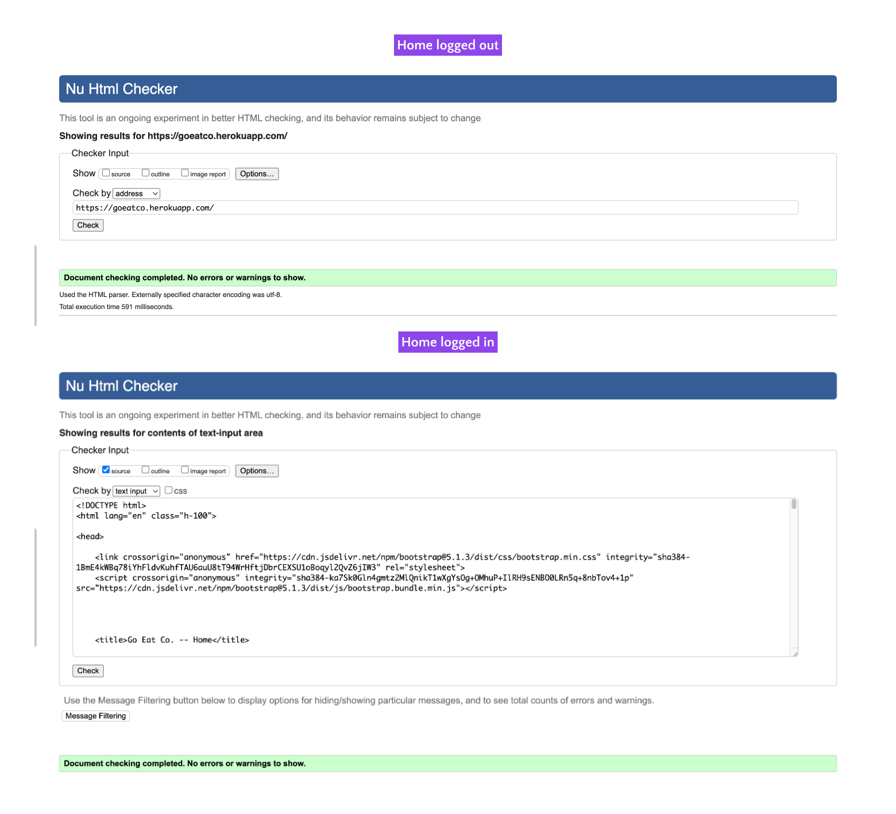
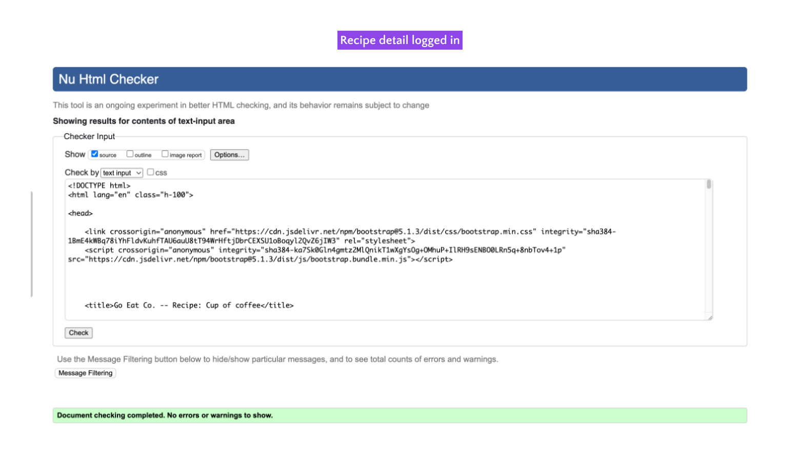
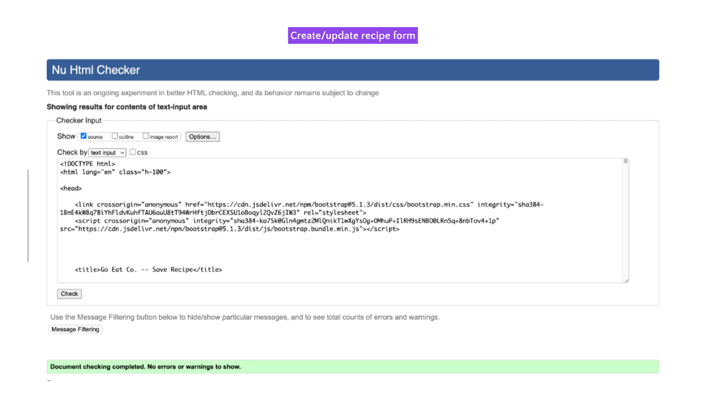
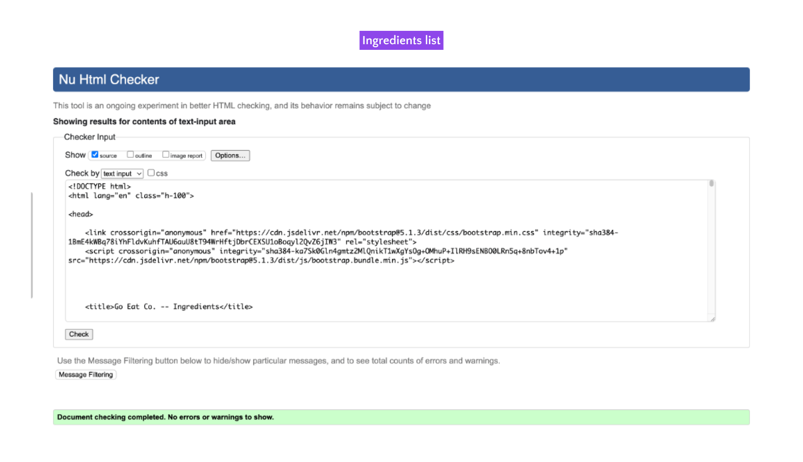

# Go Eat Co. Testing

## HTML validation

The [W3C Markup Validation Service](https://validator.w3.org/) was used to validate the HTML of the website. For logged in pages, the page source was copied and pasted into the validator. All pages pass with 0 errors and 0 warnings. Here are the main pages:

Home page

Recipe detail page

Create/update recipe page

Ingredient list

