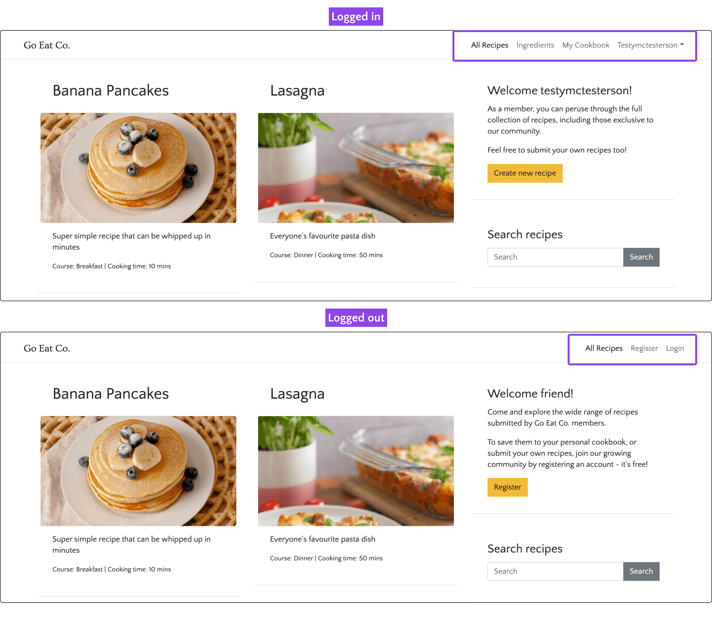
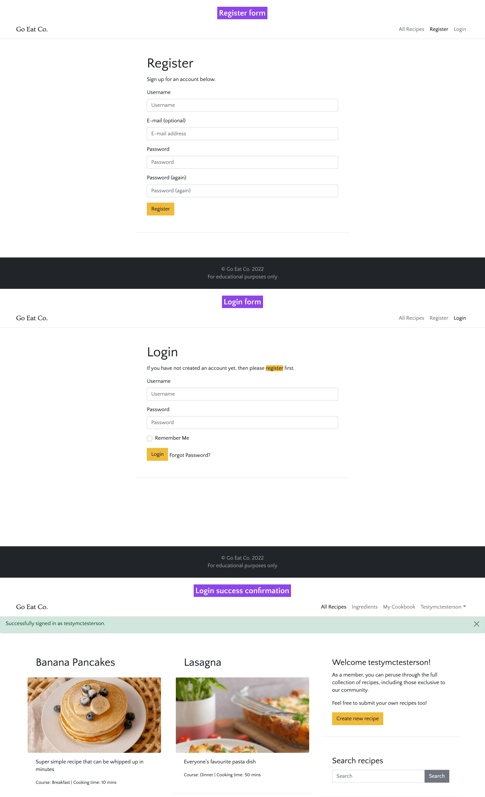
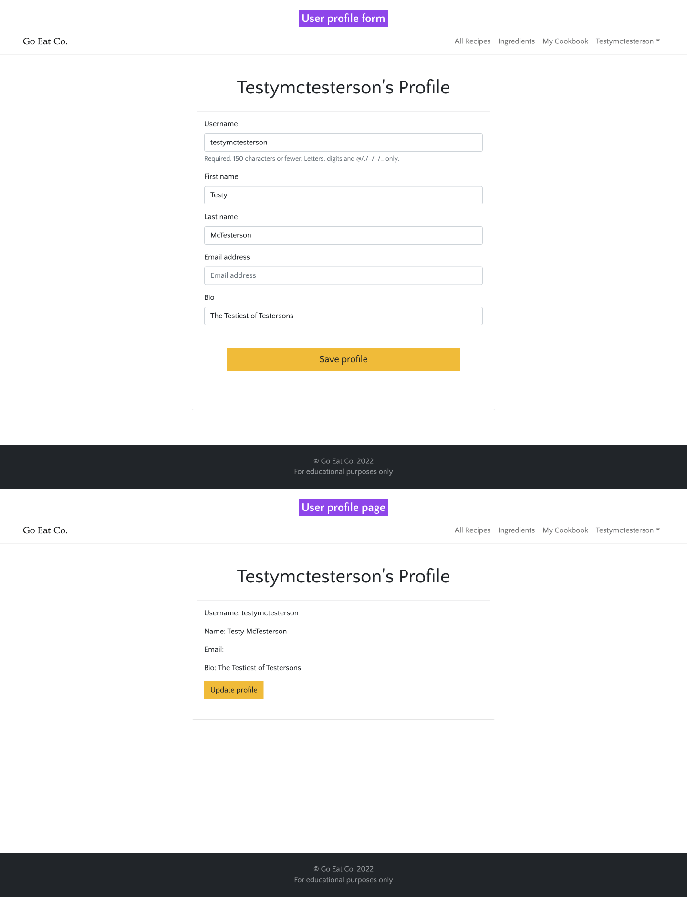
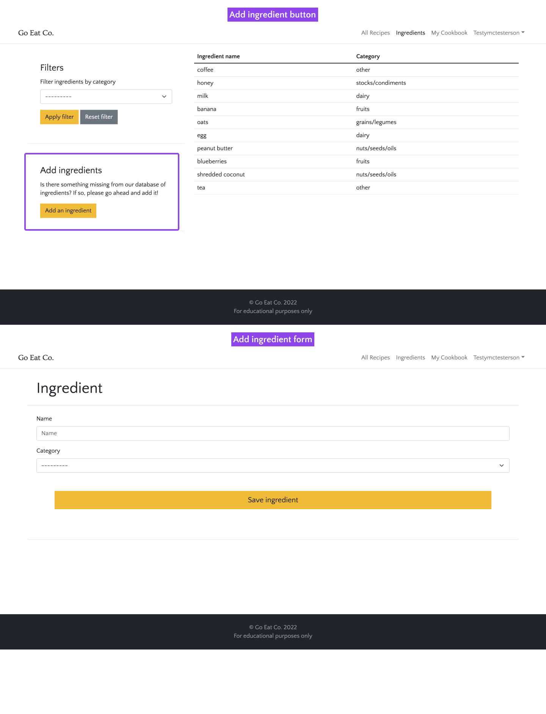
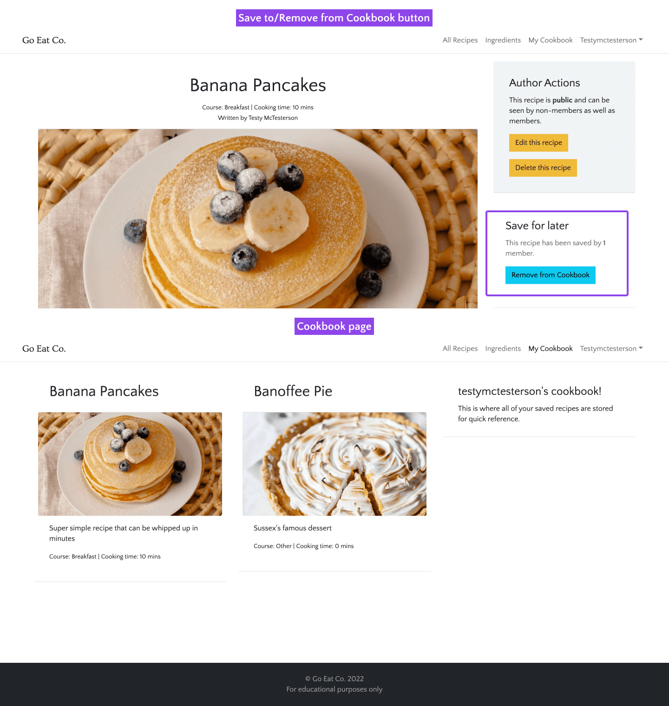
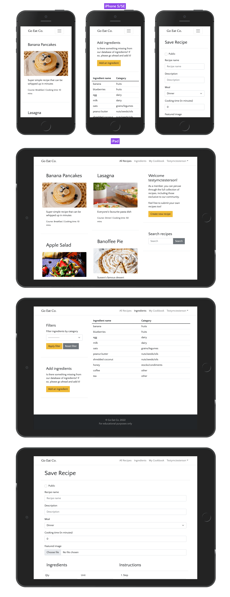

# Go Eat Co. Testing

- [Go Eat Co. Testing](#go-eat-co-testing)
  - [Google Chrome's Lighthouse performance](#google-chromes-lighthouse-performance)
  - [Accessibility validation](#accessibility-validation)
  - [HTML validation](#html-validation)
  - [CSS validation](#css-validation)
  - [JS validation](#js-validation)
  - [PEP8 validation](#pep8-validation)
  - [Testing user stories](#testing-user-stories)

## Google Chrome's Lighthouse performance

[Google Lighthouse](https://developers.google.com/web/tools/lighthouse) was used to test the performance of the website. SEO is downgraded due to the robots.txt blocking search engines - this is deliberate due to this being an educational project.

All pages scored really well, I'm suprised considering the reliance on frameworks and Heroku! The main pages scores are shown below.

Home page

Recipe detail page

Create/update recipe page

Ingredient list

## Accessibility validation

The [WAVE WebAIM web accessibility evaluation tool](https://wave.webaim.org/) was used to ensure the website met high accessibility standards. All logged out pages pass with 0 errors.

## HTML validation

The [W3C Markup Validation Service](https://validator.w3.org/) was used to validate the HTML of the website. For logged in pages, the page source was copied and pasted into the validator. All pages pass with 0 errors and 0 warnings. Here are the main pages:

Home page

Recipe detail page

Create/update recipe page

Ingredient list

*Go back to the [top](#table-of-contents)*

---

## CSS validation

The [W3C Jigsaw CSS Validation Service](https://jigsaw.w3.org/css-validator/validator) was used to validate the CSS of the website. The CSS passes with 0 errors. There are 254 warnings due to Bootstrap's CSS, and 2 warnings for my custom file. The warnings are flaggin up the border and background colours being the same, but this is required to override Bootstrap's styles.

*Go back to the [top](#table-of-contents)*

---

## JS validation

[JSHint](https://jshint.com/) was used to validate the JavaScript/Jquery of the website. No issues were found.

*Go back to the [top](#table-of-contents)*

---

## PEP8 validation

[PEP8 Online](http://pep8online.com) was used to validate the Python code on the site. The only issues found were a few longer lines in the project's settings.py

*Go back to the [top](#table-of-contents)*

---

## Testing user stories

1. As a user I want the app to be simple to navigate so I can find my way around easily.

| **Feature**  | **Action**   | **Expected Result** | **Actual Result** |
| ------------ | ------------ | ------------------- | ----------------- |
| Navigation bar | Open any page of the app | Be able to navigate to any other page easily | Works as expected |

Screenshots

2. As a user I want to login to an area of the app where I can see information that's relevant to just me.

| **Feature**  | **Action**   | **Expected Result** | **Actual Result** |
| ------------ | ------------ | ------------------- | ----------------- |
| Register account | Click on "Register" | Register an account | Works as expected
| User login | Click on "Login" | Be able to access logged-in areas of the site, such as Cookbook | Works as expected |

Screenshots

3. As a user I want to manage my profile so I can keep it up to date.

| **Feature**  | **Action**   | **Expected Result** | **Actual Result** |
| ------------ | ------------ | ------------------- | ----------------- |
| My Profile page | Hover over username, click on "My Profile". Then click on "Update profile" button | Be able to update profile information                | Works as expected           |

Screenshots

4. As a user I want to add ingredients to the database to be added to future recipes.

| **Feature**  | **Action**   | **Expected Result** | **Actual Result** |
| ------------ | ------------ | ------------------- | ----------------- |
| Ingredient List | Click on "Ingredients". Click on "Add an ingredient" button | Create an ingredient                | Works as expected           |

Screenshots

5. As a user I want to add recipes that can be shared with the community.

| **Feature**  | **Action**   | **Expected Result** | **Actual Result** |
| ------------ | ------------ | ------------------- | ----------------- |
| Homepage sidebar | Click on "Create new recipe" button | Create a recipe                | Works as expected           |

Screenshots

6. As a user I want to manage my own recipes so I can edit or remove them as required.

| **Feature**  | **Action**   | **Expected Result** | **Actual Result** |
| ------------ | ------------ | ------------------- | ----------------- |
| Recipe detail page | Go to home/"All recipes" page. Click on authored recipe. Click on "Edit this recipe" | Update the recipe details                | Works as expected           |
| Recipe detail page | Go to home/"All recipes" page. Click on authored recipe. Click on "Delete this recipe" | Delete the recipe                | Works as expected           |

Screenshots

7. As a user I want to be able to save recipes to a personal cookbook to find favourites quickly.

| **Feature**  | **Action**   | **Expected Result** | **Actual Result** |
| ------------ | ------------ | ------------------- | ----------------- |
| Recipe detail page | Go to home/"All recipes" page. Click on "Save to cookbook" button | Saves the recipe to the Cookbook                | Works as expected           |
| Cookbook page | Open the Cookbook page | See all saved recipes in one place | Works as expected |

Screenshots

8. As a user I want to be able to search recipes to find something faster than just browsing.

| **Feature**  | **Action**   | **Expected Result** | **Actual Result** |
| ------------ | ------------ | ------------------- | ----------------- |
| Home page sidebar | Go to home/"All recipes" page. Add a search query to the search field in the sidebar. Click "Search" button | The relevant search results appear on the page                | Works as expected           |

Screenshots

~~9. As a user I want to see recipe ratings to see how others found them.~~
~~10. As a user I want to follow recipe authors to see when they publish new recipes.~~

User stories 9 and 10 were omitted from the MVP of the app.

11.   As a user I expect the app to be responsive.

| **Feature**  | **Action**   | **Expected Result** | **Actual Result** |
| ------------ | ------------ | ------------------- | ----------------- |
| Responsive design | View the site on different devices | Site alters to fit the different screen sizes                | Works as expected           |

Screenshots

12.  As a user I expect the app to be accessible.

!!!!!!!See accessibility testing.

13. As a user I expect my data to be secure.

| **Feature**  | **Action**   | **Expected Result** | **Actual Result** |
| ------------ | ------------ | ------------------- | ----------------- |
| Cross site request forgery (CSRF) protection | Submit information via any form | Data is secure                | Works as expected           |

Screenshots

14. As a user I expect the app to give me feedback on my actions.

| **Feature**  | **Action**   | **Expected Result** | **Actual Result** |
| ------------ | ------------ | ------------------- | ----------------- |
| Forms | Try to submit incorrect information in a form | The form does not submit and flags the issue                | Works as expected           |

Screenshots

15. As the site owner, I want only superusers to be able to edit or remove ingredients to prevent them being accidentally removed from existing recipes.

| **Feature**  | **Action**   | **Expected Result** | **Actual Result** |
| ------------ | ------------ | ------------------- | ----------------- |
| Ingredient list | Login as superuser and go to ingredient list | See "Edit" and "Delete" buttons for ingredients                | Works as expected           |
| Ingredient list | Login as a normal user and go to ingredient list | See just the list of ingredients (no action buttons)                | Works as expected           |
| Update Ingredient page | Logout or login as a normal user and go to /ingredients/update/1/ | See a 404 page                | Works as expected           |

Screenshots

16.  As the site owner, I want only logged in users to be able to create recipes/ingredients and save recipes.

| **Feature**  | **Action**   | **Expected Result** | **Actual Result** |
| ------------ | ------------ | ------------------- | ----------------- |
| Home page sidebar | Logout and go Home | Unable to see the "Create new recipe" button                | Works as expected           |
| Create recipe page | Logout and navigate to /recipe/create | Redirected to login page                | Works as expected           |
| Home page sidebar | Login and go Home | See the "Create new recipe" button | Works as expected |
| Navigation bar | Logout and go to any page | Unable to see the Ingredients link in the navbar | Works as expected |
| Ingredients page sidebar | Login and go to Ingredients page | See "Add an ingredient" button in the sidebar

Screenshots

17. As the site owner, I want only logged in users to be able to see community exclusive recipes.

| **Feature**  | **Action**   | **Expected Result** | **Actual Result** |
| ------------ | ------------ | ------------------- | ----------------- |
| Exclusive recipes | Create a recipe, leave "Public" box unchecked, logout and go Home | The new recipe won't be there or be searchable                | Works as expected           |

Screenshots

18. As the site owner, if an error occurs, I want users to be able to navigate back to the homepage without using the back button.

| **Feature**  | **Action**   | **Expected Result** | **Actual Result** |
| ------------ | ------------ | ------------------- | ----------------- |
| Custom 404 page | Go to a random URI | See custom 404 page                | Works as expected           |

Screenshots

*Go back to the [top](#table-of-contents)*